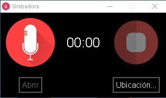

# Grabadora de audio en Python con Tkinter

Esta es una aplicación de grabadora de audio simple desarrollada en Python utilizando la biblioteca Sounddevice y Tkinter para la interfaz gráfica. La grabadora permite a los usuarios capturar y guardar archivos de audio en formato WAV.

## Screenshots

